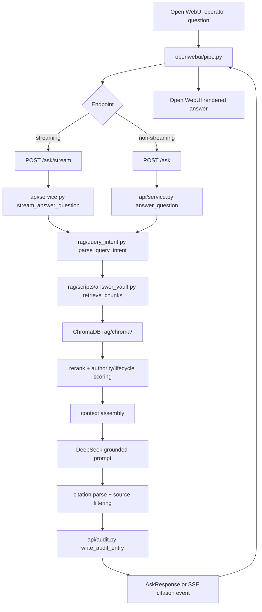

# SafePassage Second Brain Architecture

This document explains the SafePassage Second Brain data flow for a new engineer or operator. The core rule is simple: `vault/` is the source of truth, and `rag/chroma/` is disposable derived data.

## System Boundaries

Open WebUI is a presentation layer. It does not own retrieval, memory, business rules, ingestion, ChromaDB, or authority decisions. The backend owns query handling through FastAPI, and the RAG layer owns indexing and retrieval from vault Markdown.

Current query path:

```text
Open WebUI -> FastAPI /ask or /ask/stream -> api/service.py
-> rag/scripts/answer_vault.py -> ChromaDB retrieval -> DeepSeek grounded answer
-> citations / refusal / confidence -> openwebui/pipe.py -> Open WebUI
```

## Query Flow



The query flow starts when an operator asks a question in Open WebUI. `openwebui/pipe.py` forwards the prompt to `/ask/stream` when streaming is available, or `/ask` for the non-streaming path. Both endpoints route into `api/service.py`.

`api/service.py` first handles guarded slash-command states such as `/post-orders`, `/announcements`, `YES`, `NO`, `KEEP NEW`, and `KEEP OLD`. If the request is a normal retrieval query, it checks ambiguous community aliases, optionally resolves missing community context from recent user history, and calls `retrieve_chunks()` in `rag/scripts/answer_vault.py`.

`rag/query_intent.py` extracts deterministic intent before retrieval: known community, community alias, expected document types, operational topic terms, scope hints, requested-all hints, default-workflow intent, and call-flow intent. The topic dictionary lives in `rag/config/query_topics.json`.

`retrieve_chunks()` embeds the expanded query, reads ChromaDB from `rag/chroma/`, fetches a broad candidate set, and applies deterministic filtering and scoring:

- community match boosts and mismatch penalties
- expected document type boosts and mismatch penalties
- authority boosts preserving `post_order > announcement > primary_workflow`
- lifecycle and temporal boosts/penalties
- section weighting and low-value section filtering
- deterministic reranking from `rag/retrieval_rerank.py`
- near-duplicate suppression
- scoped post-order ordering using `scope_key`

For call-flow questions, `answer_vault.py` also pulls global SOP chunks so the answer can combine primary workflow with community-specific post orders and QA tips. It builds a context packet, calls DeepSeek with `rag/prompts/answer_from_context.md`, strips model-generated source blocks, parses inline source IDs, and returns citations.

`api/service.py` converts chunks into API source objects, deduplicates answer citations by source file, writes an audit entry with `api/audit.py`, and returns either an `AskResponse` or a final SSE citation event. The pipe renders the answer and citations in Open WebUI.

## Ingestion Flow

```text
Operator paste
-> /post-orders or /announcements slash command
-> api/ingest.py preview and confirmation state
-> refresh_post_orders.py or refresh_announcements.py
-> vault/03_Post_Orders/ or vault/05_Announcements/
-> rag/scripts/index_vault.py (--files incremental or full rebuild)
-> ChromaDB under rag/chroma/
```

Text ingestion is guarded and deterministic. The operator can paste post orders through `/post-orders` or announcements through `/announcements`. `/post-orders` supports a two-step wizard when no payload is supplied: first resolve a community alias, then paste the post-order text. Both commands return a preview before writing.

Nothing is written to `vault/` until the operator explicitly replies `YES`. `NO` cancels. If the post-order preview finds a same-topic active rule, the operator must choose `KEEP NEW` or `KEEP OLD` before the normal `YES`/`NO` confirmation.

Confirmed post orders call `automation/ingestion/refresh_post_orders.py`. Confirmed announcements call `automation/ingestion/refresh_announcements.py`. These scripts create managed Markdown files in:

- `vault/03_Post_Orders/` for `type: post_order`
- `vault/05_Announcements/` for `type: announcement`

After confirmed ingestion, `api/ingest.py` runs `rag/scripts/index_vault.py` with `--files` for recently modified vault files when possible. If no changed files are detected, it falls back to a full rebuild. ChromaDB is derived state and may be rebuilt from the vault at any time.

## Dashboard Flow

```text
GET /dashboard/*
-> api/dashboard.py
-> rag/dashboard.py
-> ChromaDB metadata scan
-> grouped briefing sections
```

Dashboard endpoints are read-only. `api/dashboard.py` exposes:

- `GET /dashboard/status`
- `GET /dashboard/summary`
- `GET /dashboard/briefing`
- `GET /dashboard/announcements`
- `GET /dashboard/post-orders`
- `GET /dashboard/issues`

`rag/dashboard.py` scans ChromaDB metadata and groups indexed items into operational briefing sections such as temporary protocols, gate/NVR/kiosk issues, active events, operational reminders, expiring-soon items, community-specific alerts, and QA/compliance warnings.

The dashboard excludes derived reports, visitor logs, incidents, daily briefings, low-value sections, primary workflow documents, archived/superseded/review items, and non-current temporal states. It does not write to `vault/`, run ingestion, update ChromaDB, or override source authority.

## OCR Flow

```text
Image
-> automation/ocr/ocr_extract.py
-> automation/ocr/output/
-> human review
-> automation/ocr/review_queue/approved/
-> automation/ocr/ocr_review_bridge.py
-> automation/ingestion/reviewed_ocr_inputs/
-> operator runs ingestion script manually
```

OCR is intake-only. `automation/ocr/ocr_extract.py` accepts image files, runs local OCR, and writes raw and review Markdown artifacts under `automation/ocr/output/`. OCR artifacts require human review before use.

Approved OCR review files must declare `review_status: approved`, `approved_for_ingestion: true`, and `target_ingestion_type: announcement` or `post_order`. `automation/ocr/ocr_review_bridge.py` then copies the reviewed text into staging files under `automation/ingestion/reviewed_ocr_inputs/`.

The OCR bridge does not write to `vault/`, call post-order or announcement ingestion scripts, update ChromaDB, or summarize the text. After staging, an operator must manually run the appropriate deterministic ingestion script and rebuild or incrementally update ChromaDB.

## Authority and Lifecycle

Authority hierarchy is mandatory:

```text
post_order > announcement > primary_workflow
```

`qa_rule` is advisory support. It may be retrieved with post orders, but it must not override active post orders.

Lifecycle priority is:

```text
active > pending > superseded/archived/expired/unknown
```

Active sources are authoritative for operational answers. Pending and not-yet-active sources are advisory and should be labelled as such. Superseded, archived, expired, review, conflict, needs-review, and unknown-temporal sources are penalized, skipped in many paths, or used only with warnings.

## Key Config Files

- `rag/config/community_aliases.json`: maps operator aliases such as `SR`, `CBK`, and `GLEN` to canonical community names.
- `rag/config/query_topics.json`: defines known operational topics, expected document types, preferred sections, global allowance, and call-flow flags.
- `rag/config/retrieval_config.json`: controls retrieval scoring, authority boosts, lifecycle penalties, low-value sections, near-duplicate thresholds, and known communities.
- `automation/ingestion/ingestion_contract.json`: documents the structured ingestion contract and processing stages for the older n8n-ready ingestion pipeline.
- `automation/ingestion/routing_rules.json`: maps document classifications to vault folders and templates.

## Operational Invariants

- `vault/` is the source of truth.
- `rag/chroma/` is derived and disposable.
- Announcements never override post orders.
- Primary workflow is global default guidance only.
- OCR never bypasses human review.
- Open WebUI never owns business logic.
- Audit logging must never break a query.
